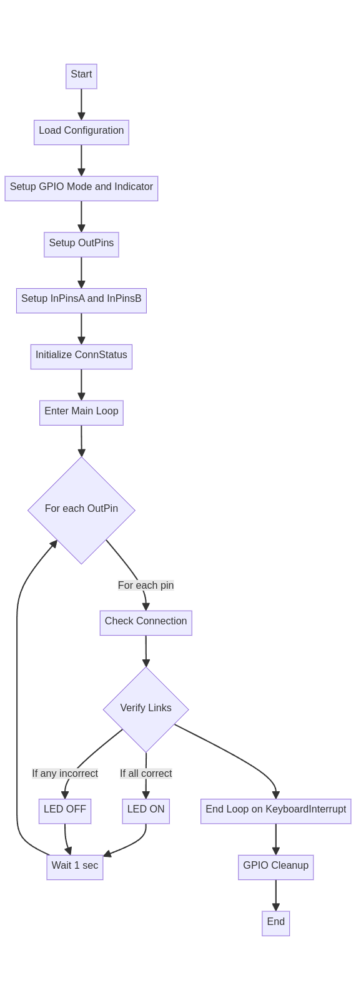

# Raspberry Pi Cable Harness Tester

This project develops a system using a Raspberry Pi 4 to verify the correct pinning of a cable harness (Y-cable with 3 connectors, each having 6 pins). The system indicates the correct connection through an externally connected LED.

## Project Structure

```
cableTester
├── config
│   └── gpio_config.json
├── logs
│   └── log.txt
├── README.md
├── scripts
├── setup_autostart.sh
├── src
│   └── main.py
└──
|
└── Video_Of_Working RPI
```
## Flow Chart 
 

## Algorithm Overview
The script's algorithm is designed to efficiently verifies the connectivity of a Y cable harness which has 3 connectors. by configuring one connector -6 pin- as an output. and the other two as an input and also a LED indicator that lights up green if the connections are proper. The verification process involves reading the state of input pins and comparing them against expected conditions that signify correct wiring.

## Detailed Algorithm Workflow

1. **Configuration Loading:**
   - Loads a JSON configuration file specifying GPIO pins for output, input, and the LED indicator.

2. **GPIO Setup:**
   - Initializes the GPIO system in a specific mode.
   - Configures GPIO pins according to their roles: output pins set low initially, input pins with pull-up resistors, and the LED indicator off.

3. **Verification Process:**
   - **Loop Start:** Begins the main execution loop.
   - **Connection Check:** For each output pin, checks corresponding input pins for electrical connection.
   - **Status Update:** Updates a connection status list based on the connection check.
   - **Overall Verification:** Uses `verifyLinks` to determine if all connections are correct.
   - **Indicator Update:** Turns the LED on or off based on the overall connection status.

## Autostart Configuration

The project includes scripts to configure your Raspberry Pi to automatically start the cable tester script at boot.

### `setup_autostart.sh`

This script configures your system to automatically run `start_on_boot.sh` at startup. It adds a command to `/etc/rc.local` to execute the `start_on_boot.sh` script, ensuring that the main Python script starts running after the system boots.

To use this script:

1. Navigate to the project's root directory.
2. Make the script executable: `chmod +x setup_autostart.sh`
3. Run the script: `./setup_autostart.sh`
4. Follow the prompts to complete the setup. You may be asked to reboot your Raspberry Pi to apply the changes.

### `start_on_boot.sh`

This script is called by `setup_autostart.sh` at system startup. It waits for the network to stabilize (optional), then runs `main.py` from the `src` directory, logging output to `logs/log.txt`.

To modify the wait time for the network or the path of the Python script, edit `start_on_boot.sh` accordingly.


### Prerequisites

- Raspberry Pi 4 with Raspbian OS
- Python 3.x installed

### Installation

Clone this repository to your Raspberry Pi:

```bash
git clone https://github.com/aabdelghani/cableTester.git
cd cableTester
```

### Hardware Setup

Connect each of the 3 cable harness connectors to 6 designated GPIO pins on the Raspberry Pi. Connect the LED to a GPIO pin to indicate the test result. Refer to `gpio_config.json` for pin assignments.

### Configuration

Modify `gpio_config.json` to match your GPIO pin setup for the cable connectors and the LED indicator.

Example `gpio_config.json`:

```json
{
    "OutPins": [2, 3, 4, 17, 27, 22],
    "InPinsA": [10, 9, 11, 5, 6, 13],
    "InPinsB": [18, 23, 24, 25, 8, 7],
    "Indicator": 21
}
```

### Usage

The script is designed to run at startup. Ensure it is executable and configured to launch when the Raspberry Pi boots up.

## Contributing

Feel free to contribute to improving the code, hardware setup, or documentation. Submit a pull request or open an issue for discussion.

## License

This project is under the MIT License. See the LICENSE file for more details.
